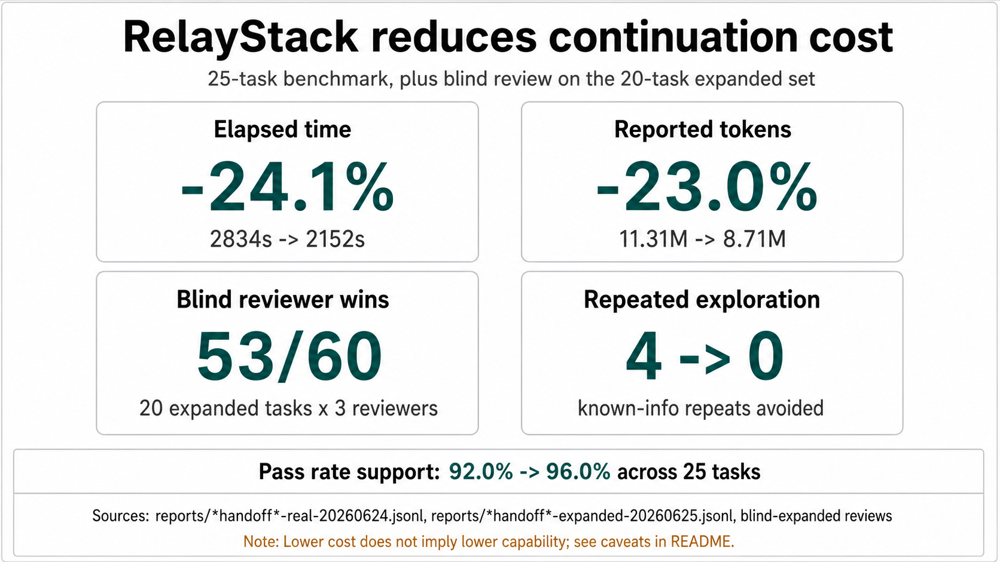

<p align="right">
  English | <a href="./README.zh-CN.md">简体中文</a>
</p>

# RelayStack

RelayStack is a skill-based handoff protocol for AI-assisted software work.
It turns scattered chat context, local Git evidence, project docs, and agent
records into a Markdown handoff snapshot the next person or agent can continue
from.

It is not an agent orchestrator, task tracker, web app, or workflow platform.
The first useful version is deliberately small: install a few repo-local
skills, run one snapshot generator, and prove that the next owner can keep
working without reading the whole previous session.

## Why It Exists

AI coding agents are good at doing work inside one session. Team delivery
breaks when that work has to move:

- decisions live in chat instead of the project
- changed files do not explain why they changed
- parallel agents can overlap without an explicit write boundary
- the next owner cannot see blockers, risks, or validation status
- project knowledge decays into repeated mistakes

RelayStack makes the handoff itself the product surface.

## Design Philosophy

The programmer is the in-loop owner of software delivery. They can treat parts
of the implementation as a black box, but they must keep control of intent,
boundaries, quality, and validation. When the system behaves strangely, they
must be able to dive deeper.

RelayStack is built around that stance:

- AI executes, but people own the software direction.
- Workflow artifacts should make decisions traceable, not replace judgment.
- Project docs should act as attractors for stable facts, not as a transcript
  of every messy step.
- Handoffs should preserve evidence, risks, and next actions.
- The smallest durable project memory is better than a large process archive
  nobody reads.

## How It Works

```text
current work state
├── manual fields: goal, stage, owner, blocker, risk, next step
├── local Git evidence: status, diff summary, changed files, recent commits
├── stable project docs: context, backlog, requirements, design, architecture
└── optional agent records: worker notes, reviewer notes, conflict notes
    ↓
handoff/snapshot-<timestamp>.md
    ↓
next person or agent continues the work
```

RelayStack uses a small set of owner docs as attractors for durable team truth:

```text
docs/context/
docs/backlog/
docs/requirements/
docs/design/
docs/architecture/
```

Temporary planning, heavy process notes, and agent scratch work stay out of the
team repository until they become stable facts. Put them into a handoff snapshot
when the work needs to move.

## Design Entities

| Entity | Purpose |
|---|---|
| Context | Stable project rules, source-of-truth notes, and local conventions |
| Backlog | Prioritized work and next actions |
| Requirements | Capability goals, user-visible behavior, and product constraints |
| Design | Feature behavior, owner docs, and implementation-facing decisions |
| Architecture | Current technical structure, boundaries, and integration points |
| Roadmap | Decomposition for work too large for one feature pass |
| Feature | A staged path for designing, implementing, and accepting new capability |
| Issue | A root-cause path for reporting, analyzing, and fixing broken behavior |
| Knowledge | Reusable lessons, recipes, decisions, and code exploration evidence |
| Handoff Snapshot | The transfer artifact that lets the next owner continue safely |

## Workflows

```text
adopt repo       rs-onboard
fuzzy idea       rs-brainstorm → rs-feat / rs-roadmap
large work       rs-roadmap → smaller feature passes
new capability   rs-feat → rs-feat-design → rs-feat-impl → rs-feat-accept
fast feature     rs-feat-ff
broken behavior  rs-issue-report → rs-issue-analyze → rs-issue-fix
knowledge        rs-learn / rs-trick / rs-decide / rs-explore
public docs      rs-guide / rs-libdoc
handoff          rs-handoff
```

## Handoff Snapshot

`rs-handoff` generates:

```text
handoff/snapshot-<timestamp>.md
```

The snapshot answers:

1. What is the current goal?
2. What has already been done?
3. Which files changed?
4. Why did the work move this way?
5. What is blocked or risky?
6. What should happen next?
7. How should the next owner validate completion?

It also carries three small quality contracts:

- `Evidence Map`: ties key claims to local sources such as Git evidence,
  project docs, user input, and agent records.
- `Risk Register`: records the risk, trigger, impact, and mitigation instead
  of a vague warning.
- `Next Action Contract`: names the next action, inputs, touched files,
  validation command, and done signal.

When multiple agent records are attached, the snapshot also includes an
`Agent parallel boundary` section covering write scopes, adoption state,
explicit conflicts, validation, and overlapping file-scope warnings.

Agent records can be JSON or Markdown frontmatter. The useful fields are:

```json
{
  "agent": "worker_a",
  "role": "worker",
  "task": "Implement the snapshot contract",
  "write_scope": ["skills/rs-handoff/scripts/generate_snapshot.py"],
  "status": "completed",
  "adoption": "accepted",
  "adopted_output": "Evidence Map was kept",
  "rejected_reason": "No workflow engine added",
  "conflicts": [],
  "verification": ["self-test"]
}
```

## Quick Start

Install all skills into `$CODEX_HOME/skills` or `~/.codex/skills`:

```bash
python3 scripts/install_skills.py --all
```

Generate a snapshot from the workspace root:

```bash
python3 skills/rs-handoff/scripts/generate_snapshot.py \
  --task "RelayStack MVP" \
  --goal "Generate one useful handoff snapshot from real project evidence" \
  --stage "MVP implementation" \
  --owner "current agent" \
  --next-step "Give the snapshot to the next owner" \
  --validation "Read the snapshot and answer the handoff questions"
```

Attach optional agent records:

```bash
python3 skills/rs-handoff/scripts/generate_snapshot.py \
  --agent-record path/to/worker-a.json \
  --agent-record path/to/reviewer-b.md
```

Useful checks:

```bash
python3 scripts/install_skills.py --self-test
python3 skills/rs-handoff/scripts/generate_snapshot.py --self-test
```

## Skill Overview

Use `rs` when you are not sure which RelayStack skill should handle a request.
It routes to the smallest useful entry point.

| Group | Skill | Purpose |
|---|---|---|
| Adoption | `rs-onboard` | Adopt the owner-doc layout in a new or existing repository |
| Requirements & Architecture | `rs-req` | Capture or update stable capability requirements |
|  | `rs-arch` | Backfill, update, or check architecture docs |
| Roadmap | `rs-roadmap` | Split a large goal into smaller feature passes |
| Discussion Entry | `rs-brainstorm` | Triage a fuzzy idea into design, feature, or roadmap work |
| Feature Flow | `rs-feat` | Entry point for new capability work |
|  | `rs-feat-design` | Draft the design that later implementation should follow |
|  | `rs-feat-impl` | Implement according to the approved design order |
|  | `rs-feat-accept` | Check the implementation against design and update durable docs |
|  | `rs-feat-ff` | Fast path for tiny clear features |
| Issue Flow | `rs-issue` | Entry point for broken behavior |
|  | `rs-issue-report` | Turn a suspected bug into a reproducible report |
|  | `rs-issue-analyze` | Find root cause, assess risk, and propose a fix |
|  | `rs-issue-fix` | Apply a confirmed fix and record validation |
| Knowledge | `rs-learn` | Capture reusable lessons from work already done |
|  | `rs-trick` | Capture reusable coding recipes or library usage |
|  | `rs-decide` | Record settled technical decisions and long-term constraints |
| Exploration & Docs | `rs-explore` | Preserve focused code exploration evidence |
|  | `rs-guide` / `rs-libdoc` | Write task-oriented guides or API/reference docs |
| Handoff | `rs-handoff` | Generate a snapshot for the next person or agent |

## Compared With

| Tool | Best at | RelayStack differs by |
|---|---|---|
| Superpower | Expanding what an agent can do through skills and reusable capabilities | Adding a handoff contract around the work: evidence, boundaries, risks, next step, and validation |
| Trellis | Keeping a structured project workspace with specs, tasks, workflow notes, and continuity logs | Staying smaller: a few stable owner docs plus one snapshot artifact, without becoming a task system |
| OpenSpec | Driving changes from explicit specs | Treating specs as one input, then packaging the current work state so another owner can continue safely |

Use Superpower when the agent needs more capability. Use Trellis when the team
wants a broader workspace convention. Use OpenSpec when the main gap is
spec-first change definition. Use RelayStack when the main gap is handoff:
what changed, why, what is risky, and how the next owner continues.

## Continuation Cost



Across the current 25-task benchmark, RelayStack handoff reduced elapsed time
by `24.1%` and reported tokens by `23.0%`. On the 20-task expanded blind
review, `rs_handoff` won `53/60` reviewer decisions and reduced repeated
known-info exploration from `4` to `0`. Pass rate remains supporting evidence:
`92.0%` without handoff versus `96.0%` with handoff.

The benchmark keeps the value proof narrow:

- `elapsed_seconds`: total continuation time through `test.sh`
- `total_tokens` / `cost_usd`: reported model usage when available
- `repeated_known_info` / `repeated_known_files`: whether the agent reopened
  facts already present in the handoff
- `continuation_success`: whether the task test passed
- `handoff_question_score`: optional 0-7 score for the seven handoff questions

The demo succeeds when a new person or new agent can read only the snapshot and
continue the next step within 5 minutes.

## Scope Guard

RelayStack does not include a web UI, database, account system, real-time
collaboration, auto-commit, task management, full semantic code analysis, or a
hard dependency on an LLM API.

Add platform pieces only when one useful snapshot stops being enough.
