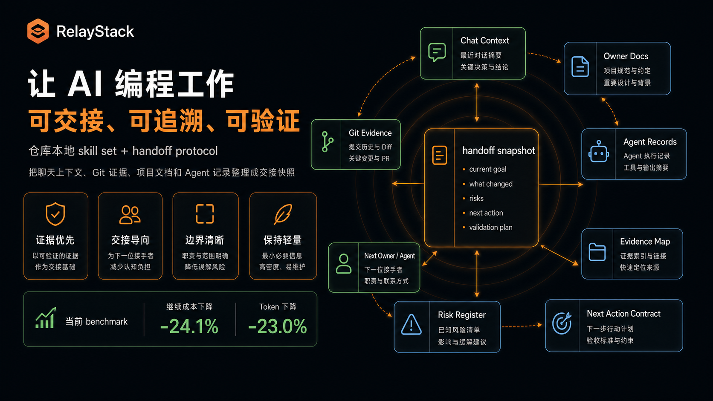
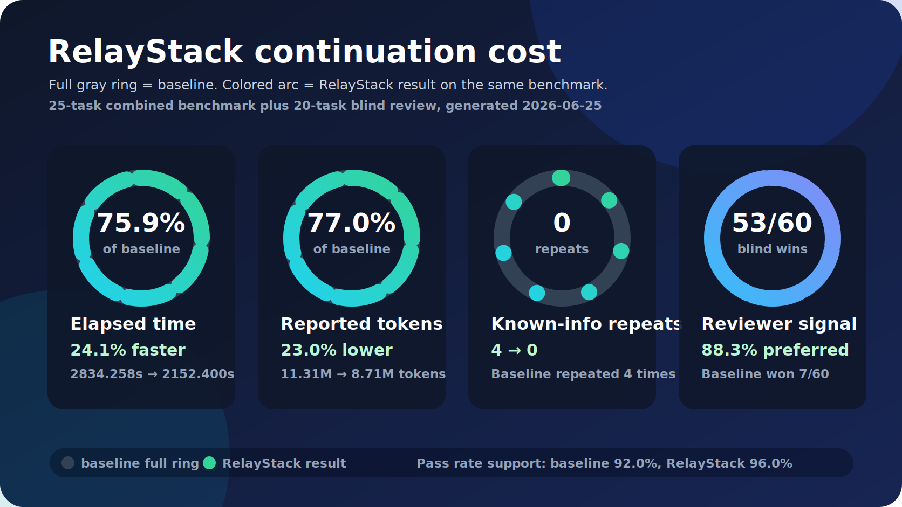
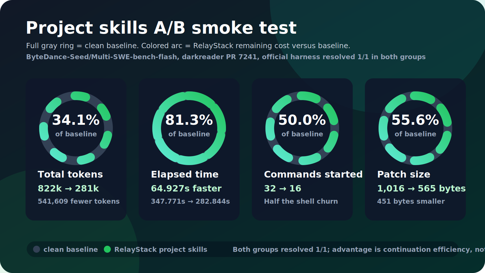

<p align="right">
  <a href="./README.md">English</a> | 简体中文
</p>

# RelayStack



<video src="reports/assets/relaystack-intro.mp4" controls poster="reports/assets/relaystack-intro.png">
  观看 RelayStack 项目介绍视频：reports/assets/relaystack-intro.mp4
</video>

RelayStack 是一组 repo-local skills，也是一套 AI 辅助开发的交接协议。
它把聊天上下文、本地 Git 证据、项目文档和 agent 记录整理成一份 Markdown
snapshot，让下一个人或 agent 不读完整历史会话也能继续工作。

它不是 agent 编排器或任务系统。

安装一组 repo-local skills，运行`rs-handoff`，让下一次交接真的可用。

## 为什么需要它

AI coding agent 在单次会话里很能干。真正容易断的是交接：

- 决策留在聊天里，没有进入项目
- diff 只能说明改了什么，解释不了为什么改
- 并行 agent 容易写入范围重叠，但没有明确边界
- 下一个 owner 看不到阻塞、风险和验证状态
- 项目知识会衰减，导致同类错误反复出现

RelayStack 只关注交接这件事：改了什么、为什么改、风险在哪、下一个 owner
怎么继续。

## 设计哲学

负责软件的人必须留在环内。agent 可以承担一部分实现，但意图、边界、质量和
验证仍然归人负责。系统表现异常时，人要有足够证据继续查下去。

RelayStack 把这条边界写清楚：

- AI 负责执行，但软件方向由人负责。
- 工作流产物要让决策可追溯，而不是替代人的判断。
- 项目文档只放稳定事实，不记录每一步混乱过程。
- 交接要保留证据、风险和下一步动作。
- 少量稳定项目记忆，比没人读的大型过程档案更有用。

## 它怎么工作

```text
当前工作状态
├── 手动字段：目标、阶段、owner、阻塞、风险、下一步
├── 本地 Git 证据：status、diff 摘要、改动文件、最近提交
├── 稳定项目文档：context、backlog、requirements、design、architecture
└── 可选 agent 记录：worker 结论、reviewer 结论、冲突说明
    ↓
handoff/snapshot-<timestamp>.md
    ↓
下一个人或 agent 继续工作
```

RelayStack 用少量 owner docs 保存需要跨会话保留的事实：

```text
docs/context/
docs/backlog/
docs/requirements/
docs/design/
docs/architecture/
```

临时计划、过程记录和 agent 草稿在变成稳定事实前，不塞进团队仓库。
需要换人接手时，把有用部分放进 handoff snapshot。

## 设计实体

| 实体 | 用途 |
|---|---|
| Context | 稳定项目规则、事实来源和本地约定 |
| Backlog | 优先级、待办和下一步动作 |
| Requirements | 能力目标、用户可见行为和产品约束 |
| Design | 特性行为、owner docs 和面向实现的关键决定 |
| Architecture | 当前技术结构、边界和集成点 |
| Roadmap | 把单个 feature 接不住的大目标拆小 |
| Feature | 新能力从设计、实现到验收的阶段化路径 |
| Issue | 问题从报告、根因分析到定点修复的路径 |
| Knowledge | 可复用的经验、技巧、决策和代码探索证据 |
| Handoff Snapshot | 让下一个 owner 安全继续工作的交接产物 |

## 工作流

```text
接入仓库      rs-onboard
模糊想法      rs-brainstorm → rs-feat / rs-roadmap
大型工作      rs-roadmap → 更小的 feature pass
新增能力      rs-feat → rs-feat-design → rs-feat-impl → rs-feat-accept
轻量特性      rs-feat-ff
问题修复      rs-issue-report → rs-issue-analyze → rs-issue-fix
知识沉淀      rs-learn / rs-trick / rs-decide / rs-explore
对外文档      rs-guide / rs-libdoc
工作交接      rs-handoff
```

## Handoff Snapshot

`rs-handoff` 会生成：

```text
handoff/snapshot-<timestamp>.md
```

这份 snapshot 回答 7 个问题：

1. 当前目标是什么？
2. 已经完成了什么？
3. 哪些文件被改过？
4. 为什么这样推进？
5. 有哪些阻塞或风险？
6. 下一步做什么？
7. 下一个 owner 怎么验证完成？

它还会带上 3 个很小的质量契约：

- `Evidence Map`：把关键结论绑定到本地来源，例如 Git 证据、项目文档、
  用户输入和 agent record。
- `Risk Register`：记录风险、触发条件、影响和缓解动作，而不是泛泛写“有风险”。
- `Next Action Contract`：写清下一步动作、输入、触达文件、验证命令和完成标志。

当附加多个 agent records 时，snapshot 还会生成 `Agent 并行边界`，记录写入范围、
采纳状态、冲突、验证结果和文件范围重叠警告。

Agent record 可以是 JSON，也可以是 Markdown frontmatter。常用字段：

```json
{
  "agent": "worker_a",
  "role": "worker",
  "task": "实现 snapshot 契约",
  "write_scope": ["skills/rs-handoff/scripts/generate_snapshot.py"],
  "status": "completed",
  "adoption": "accepted",
  "adopted_output": "保留 Evidence Map",
  "rejected_reason": "不增加 workflow 引擎",
  "conflicts": [],
  "verification": ["self-test"]
}
```

## 快速开始

RelayStack 的日常入口是仓库内 skills。先把它们安装到
`$CODEX_HOME/skills` 或 `~/.codex/skills`：

```bash
python3 scripts/install_skills.py --all
```

在 Codex 里，不确定该用哪个入口时使用 `rs`；要给当前工作区生成交接快照时
使用 `rs-handoff`。

下面的 Python 命令是底层脚本入口，适合手动执行、CI 和调试生成器；它们不是
日常面向 agent 的入口。

手动在工作区根目录生成一份 snapshot：

```bash
python3 skills/rs-handoff/scripts/generate_snapshot.py \
  --task "RelayStack MVP" \
  --goal "Generate one useful handoff snapshot from real project evidence" \
  --stage "MVP implementation" \
  --owner "current agent" \
  --next-step "Give the snapshot to the next owner" \
  --validation "Read the snapshot and answer the handoff questions"
```

可以附加 agent records：

```bash
python3 skills/rs-handoff/scripts/generate_snapshot.py \
  --agent-record path/to/worker-a.json \
  --agent-record path/to/reviewer-b.md
```

轻量自检：

```bash
python3 scripts/install_skills.py --self-test
python3 skills/rs-handoff/scripts/generate_snapshot.py --self-test
```

## 技能总览

不知道该用哪个 RelayStack skill 时，先用 `rs`。它只负责路由到最小可用入口。

| 分组 | 技能 | 用途 |
|---|---|---|
| 接入 | `rs-onboard` | 把新仓库或已有零散文档的仓库接入 owner-doc 结构 |
| 需求 & 架构 | `rs-req` | 整理或更新稳定能力需求 |
|  | `rs-arch` | 补齐、更新或检查架构文档 |
| 路线图 | `rs-roadmap` | 把模糊大目标拆成可推进的 feature pass |
| 讨论入口 | `rs-brainstorm` | 想法模糊时分诊到 design、feature 或 roadmap |
| 特性流程 | `rs-feat` | 新特性子流程入口 |
|  | `rs-feat-design` | 起草后续实现应遵循的 design |
|  | `rs-feat-impl` | 按已确认 design 的推进顺序写代码 |
|  | `rs-feat-accept` | 对照 design 核对实现，并更新稳定文档 |
|  | `rs-feat-ff` | 小而清晰的特性直通车 |
| 问题流程 | `rs-issue` | 已有行为出问题时的入口 |
|  | `rs-issue-report` | 把疑似 bug 落成可复现 report |
|  | `rs-issue-analyze` | 找根因、评估风险、给修复方案 |
|  | `rs-issue-fix` | 定点修复并记录验证结果 |
| 知识沉淀 | `rs-learn` | 沉淀可复用经验 |
|  | `rs-trick` | 沉淀可复用编程模式或库用法 |
|  | `rs-decide` | 记录已拍板的技术决策和长期约束 |
| 探索 & 文档 | `rs-explore` | 定向代码探索，并沉淀证据 |
|  | `rs-guide` / `rs-libdoc` | 写对外指南或 API / 库参考文档 |
| 交接 | `rs-handoff` | 生成给下一个人或 agent 的 handoff snapshot |

## 与其他工具对比

| 工具 | 更擅长 | RelayStack 的差异 |
|---|---|---|
| Superpower | 用 skills 和可复用能力增强 agent 能做什么 | 给工作增加交接契约：证据、边界、风险、下一步和验证 |
| Trellis | 用 spec、task、workflow notes 和 continuity logs 组织项目工作区 | 更小：少量稳定 owner docs 加一份 snapshot，不扩展成任务系统 |
| OpenSpec | 从明确 spec 出发驱动变更 | 把 spec 当作输入之一，再把当前工作状态打包成可继续的交接证据 |

需要增强 agent 能力时用 Superpower。需要更完整的项目工作区约定时用 Trellis。
主要缺口是 spec-first 变更定义时用 OpenSpec。主要缺口是交接时，用 RelayStack：
说清楚改了什么、为什么改、风险在哪、下一个 owner 怎么继续。

## 接手成本指标



当前 25 道 benchmark 合并口径下，RelayStack handoff 让总耗时下降 `24.1%`，
报告 token 下降 `23.0%`。在扩展 20 题盲评中，`rs_handoff` 获得 `53/60`
个 reviewer 胜场，并把重复探索已知信息从 `4` 次降到 `0` 次。成功率作为支撑信息：
不用 handoff 是 `92.0%`，使用 handoff 是 `96.0%`。

benchmark 只测一个窄口径：

- `elapsed_seconds`：执行到 `test.sh` 结束的接手耗时
- `total_tokens` / `cost_usd`：可获得时记录模型用量
- `repeated_known_info` / `repeated_known_files`：是否重复打开 handoff 已给出的事实
- `continuation_success`：任务测试是否通过
- `handoff_question_score`：可选 0-7 分，表示 7 个交接问题回答了几个

### A/B 烟测



新增两轮 Multi-SWE-bench flash 烟测，用第三方公开 issue-fixing 题源与本地
25 题区分开：

- `reports/multi-swe-clean-20260629`：clean baseline 对比只允许
  `rs-handoff`。两组生成相同 patch；handoff 使用 `306,137` tokens，
  baseline 使用 `992,884` tokens，handoff 快 `35.830s`。
- `reports/multi-swe-project-skills-20260629`：clean baseline 对比仅允许本项目
  RelayStack skills。handoff 实际使用 `rs-handoff` 和 `rs-issue-fix`，
  没有使用全局 / 插件 skill，也没有启动 subagent。handoff 使用 `280,621`
  tokens，baseline 使用 `822,230` tokens，handoff 快 `64.927s`，少启动
  `16` 个命令，patch 小 `451` bytes。

这两轮是协议隔离烟测，不包装成榜单成绩。其中 project-skills 这轮也跑通了官方
Multi-SWE-bench harness：`baseline 1/1 resolved`，
`relaystack_handoff 1/1 resolved`。

Demo 成功的标准是：一个新的人或 agent 只读 snapshot，就能在 5 分钟内继续。

## 范围保护

RelayStack 不包含 Web UI、数据库、账号系统、实时协作、自动提交、任务管理、
完整语义代码分析，也不硬依赖 LLM API。

只有当一份有用的 snapshot 不够用时，再加平台能力。
