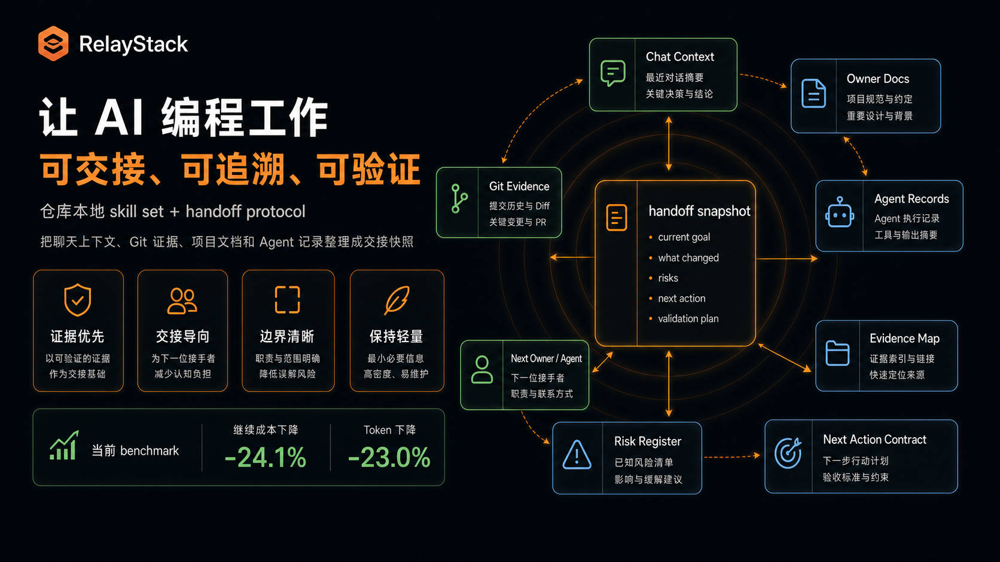
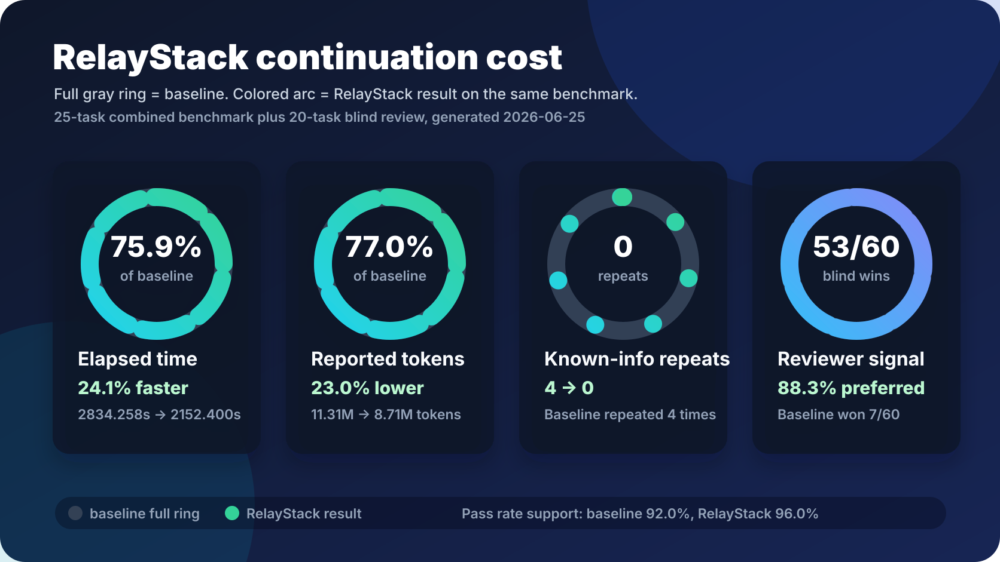
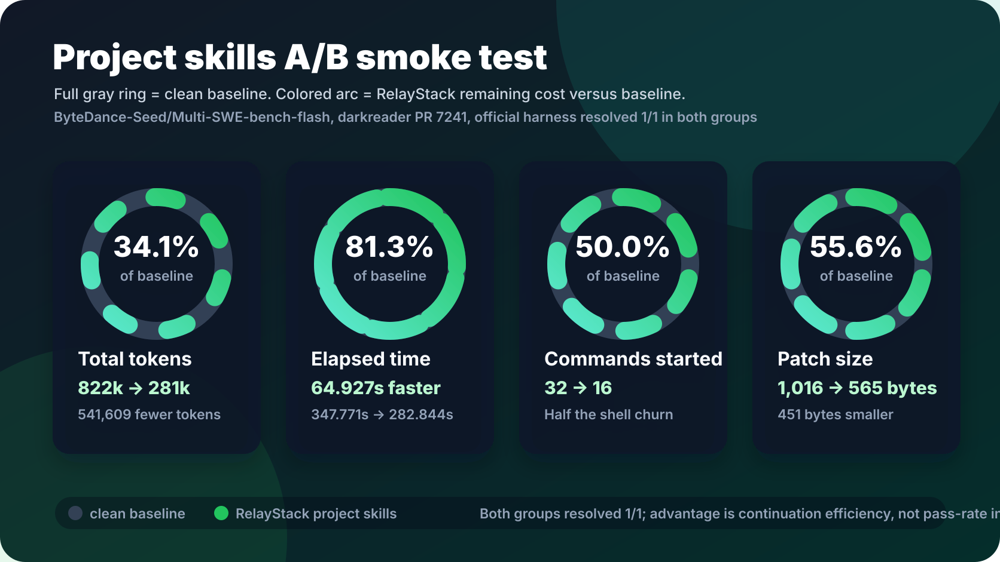

<p align="right">
  <a href="./README.md">English</a> | 简体中文
</p>

# RelayStack



[观看 RelayStack 项目介绍视频](reports/assets/relaystack-intro.mp4)

RelayStack 是一套让 AI 研发过程能够**收敛、验收、交接和续写**的工作流协议。

它的核心逻辑是：

> 模糊过程可以很复杂，但团队长期保留的事实必须少、稳定、可验证。

团队仓库只承认五类长期事实：

| 文档 | 回答的问题 |
|---|---|
| `docs/context/` | 这个项目必须遵守什么 |
| `docs/backlog/` | 接下来真正要做什么 |
| `docs/requirements/` | 产品能力和行为约束是什么 |
| `docs/design/` | 这个 Feature 获批后应该怎样工作 |
| `docs/architecture/` | 当前代码结构、边界和契约是什么 |

它们叫“attractor”，可以理解成“稳定信息的吸引子”：不管信息最初来自 brainstorm、
排障、实现还是 Agent 探索，确认后都要收敛到固定 owner，而不是不断产生 `plans/`、
`notes/`、`agent-logs/` 等无人维护的新目录。

与此同时，过程信息放在被 Git 忽略的个人目录：

```text
<personal-root>/project/
├── roadmaps/
├── features/
├── issues/
├── knowledge/
└── handoffs/
```

这样做是为了同时满足两个目标：

- Agent 可以保留详细推理、checklist、失败假设和执行记录。
- 团队仓库不会被临时过程污染，后续人员只需要阅读稳定事实。

个人笔记永远不能替代团队权威文档。

## 为什么需要它

AI coding agent 在单次会话里很能干。真正容易断的是交接：

- 决策留在聊天里，没有进入项目
- diff 只能说明改了什么，解释不了为什么改
- 并行 agent 容易写入范围重叠，但没有明确边界
- 下一个 owner 看不到阻塞、风险和验证状态
- 项目知识会衰减，导致同类错误反复出现

RelayStack 只关注交接这件事：改了什么、为什么改、风险在哪、下一个 owner
怎么继续。

## 设计哲学

负责软件的人必须留在环内。agent 可以承担一部分实现，但意图、边界、质量和
验证仍然归人负责。系统表现异常时，人要有足够证据继续查下去。

RelayStack 把这条边界写清楚：

- AI 负责执行，但软件方向由人负责。
- 工作流产物要让决策可追溯，而不是替代人的判断。
- 项目文档只放稳定事实，不记录每一步混乱过程。
- 交接要保留证据、风险和下一步动作。
- 少量稳定项目记忆，比没人读的大型过程档案更有用。

## 它怎么工作

```text
当前工作区证据
├── live current-work-state：需要续写时唯一的活动状态
│   └── id/work id、stage、owner、next action、证据指纹、context manifest
├── 本地 Git 证据：status、diff 摘要、改动文件、最近提交
├── 相关 owner 文档：先读 context，再读本轮触达的 owner
└── 可选 agent 记录：worker 结论、reviewer 结论、冲突说明
    ↓ rs-handoff
<personal-root>/project/handoffs/snapshot-<timestamp>.md（只读交接产物）
    ↓
rs-continue 校验 snapshot 后认领并更新唯一 live 状态；rs-finish-work 关闭它
```

仓库中由团队维护、可提交的项目文档只使用以下五类 owner：

```text
docs/context/
docs/backlog/
docs/requirements/
docs/design/
docs/architecture/
```

`docs/context/` 是项目级上下文的必读入口。`docs/backlog/`、`docs/requirements/`、
`docs/design/`、`docs/architecture/` 按需读取、按需创建；只有任务产生了该范围内的稳定事实
时才触达。缺少某个可选 owner 目录不代表仓库尚未接入。
owner 的触发条件分别是：`context` 记录项目级规则，`backlog` 记录持续的团队协调，
`requirements` 记录可复用的用户可观察能力契约，`design` 记录实现前需要批准的取舍，
`architecture` 记录实现后真实的技术边界。

Roadmap、可选的 Feature 和 Issue 过程记录、原始 Knowledge、Handoff Snapshot 都是
`<personal-root>/project/` 下的个人记录，不属于团队维护的项目文档。本仓库将项目根目录
作为 personal root，并通过 Git 忽略 `/project/`。多阶段工作最多维护一个个人记录；单轮工作
默认不创建记录。正式 feature design 不放在个人记录中：

```text
<personal-root>/project/
├── roadmaps/
├── features/
├── issues/
├── knowledge/
└── handoffs/
```

`docs/backlog/` 可以保存团队可见的优先级和下一步，但 roadmap 正文必须留在个人记录中。
只有需求存在需要人工批准的行为、状态、权限、迁移、术语或跨模块契约取舍时，才要求正式
feature design。需要 design 时，它必须位于 `docs/design/{slug}.md`，并作为实现和验收的
权威输入；清晰、局部、低风险的需求可以不生成 design。

触发 skill 本身不要求修改 `docs/`。每条稳定事实只有一个 canonical owner，其他文档只链接
到该 owner，不复制或重新定义事实。只有多个彼此独立的事实或契约分别变化时，才更新多个
owner docs。正式验收结果始终向用户报告，包括团队文档无需修改的情况。

需要个人记忆时，多阶段工作最多维护一个过程记录：`project/features/{slug}.md`、
`project/issues/{slug}.md` 或 `project/roadmaps/{slug}.md`。Issue 的 Report、Analysis、
Fix 和 Verification 可以按需追加到同一个文件，但都不是必经阶段。个人记录使用统一的
`id` / `backlinks` 头部，不为此批量改名历史文件；单轮小任务默认不创建个人记录。
`project/knowledge/` 仅用于独立的原始证据或明确要求的可复用笔记，不作为同一工作项的第二份
过程记录。

临时计划、过程记录和 agent 草稿在变成稳定事实前，不塞进团队仓库。需要换人接手时，
把过程证据和下一步动作放进 handoff snapshot。

## 设计实体

| 实体 | 用途 |
|---|---|
| Context | 稳定项目规则、事实来源和本地约定 |
| Backlog | 优先级、待办和下一步动作 |
| Requirements | 能力目标、用户可见行为和产品约束 |
| Design | 特性行为、owner docs 和面向实现的关键决定 |
| Architecture | 当前技术结构、边界和集成点 |
| Roadmap | 把单个 feature 接不住的大目标拆小 |
| Feature | 新能力从设计、实现到验收的阶段化路径 |
| Issue | 问题证据与定点修复的可选路径 |
| Knowledge | 可复用的经验、技巧、决策和代码探索证据 |
| Handoff Snapshot | 让下一个 owner 安全继续工作的交接产物 |
| Current Work State | 一个活跃 work item 的 live 个人状态 |

## 工作流

```text
接入仓库      rs-onboard
模糊想法      rs-brainstorm → rs-feat / rs-roadmap
大型工作      rs-roadmap → 更小的 feature pass
新增能力      rs-feat → rs-feat-ff 或 rs-feat-design → rs-feat-impl → rs-feat-accept
轻量特性      rs-feat-ff
问题修复      rs-issue（按需调用 report/analyze/fix 辅助 skill）
知识沉淀      rs-learn / rs-trick / rs-decide / rs-explore
对外文档      rs-guide / rs-libdoc
工作交接      rs-handoff
继续工作      rs-continue
结束工作      rs-finish-work
```

## Handoff Snapshot

`rs-handoff` 会生成：

```text
<personal-root>/project/handoffs/snapshot-<timestamp>.md
```

这份 snapshot 回答 7 个问题：

1. 当前目标是什么？
2. 已经完成了什么？
3. 哪些文件被改过？
4. 为什么这样推进？
5. 有哪些阻塞或风险？
6. 下一步做什么？
7. 下一个 owner 怎么验证完成？

它还会带上 3 个很小的质量契约：

- `Evidence Map`：把关键结论绑定到本地来源，例如 Git 证据、项目文档、
  用户输入和 agent record。
- `Risk Register`：记录风险、触发条件、影响和缓解动作，而不是泛泛写“有风险”。
- `Next Action Contract`：写清下一步动作、输入、触达文件、验证命令和完成标志。

snapshot 顶部还包含机器可读质量块，记录 7 个交接问题缺了几个、Evidence Map
是否覆盖核心结论、Next Action Contract 是否完整，以及当前 Git diff 的证据指纹。
后续可用 `scripts/check_snapshot_freshness.py` 判断 snapshot 生成后工作区证据是否已变化。

需要机器可消费的续写状态时，唯一的 live current-work-state 会携带 `context manifest`，
让下一位只读这轮真正需要的 docs、code 和 evidence；普通 snapshot 也可以在不创建 live
状态时生成。`rs-continue` 先校验 snapshot，再消费 active 且 manifest 非空的 live 状态，
认领下一步并重写这一个状态；`rs-finish-work` 则关闭它，把后续动作留给 handoff 或知识沉淀。

当附加多个 agent records 时，snapshot 还会生成 `Agent 并行边界`，记录写入范围、
采纳状态、冲突、验证结果和文件范围重叠警告。

Agent record 可以是 JSON，也可以是 Markdown frontmatter。常用字段：

```json
{
  "agent": "worker_a",
  "role": "worker",
  "task": "实现 snapshot 契约",
  "write_scope": ["skills/rs-handoff/scripts/generate_snapshot.py"],
  "status": "completed",
  "adoption": "accepted",
  "adopted_output": "保留 Evidence Map",
  "rejected_reason": "不增加 workflow 引擎",
  "conflicts": [],
  "verification": ["self-test"]
}
```

JSON 形态的 AgentRecord 契约见 `schemas/agent-record.schema.json`。

## 快速开始

RelayStack 通过
[RelayStack Marketplace](https://github.com/waterbird-i/relaystack-marketplace)
发布。先添加一次 marketplace，再安装插件：

```bash
codex plugin marketplace add waterbird-i/relaystack-marketplace
codex plugin add relaystack@relaystack
```

确认 Codex 已将 `relaystack@relaystack` 标记为 `installed, enabled`：

```bash
codex plugin list
```

安装后请重启 Codex 或开启新任务。插件会统一暴露完整的 `rs-*` skill 组。

本地开发时，可以在 Codex 中把当前仓库作为本地插件安装。源码开发时可使用
下面的插件校验器：

```bash
python3 scripts/validate_plugin.py
```

无法加载插件的旧环境仍可使用兼容复制器，但它安装的是单个 skill，而不是
RelayStack 插件：

```bash
python3 scripts/install_skills.py --all
```

在 Codex 里，不确定该用哪个入口时使用 `rs`；要给当前工作区生成交接快照时
使用 `rs-handoff`。

下面的 Python 命令是底层脚本入口，适合手动执行、CI 和调试生成器；它们不是
日常面向 agent 的入口。

手动在工作区根目录生成一份 snapshot：

```bash
python3 skills/rs-handoff/scripts/generate_snapshot.py \
  --task "RelayStack MVP" \
  --goal "Generate one useful handoff snapshot from real project evidence" \
  --stage "MVP implementation" \
  --owner "current agent" \
  --next-step "Give the snapshot to the next owner" \
  --validation "Read the snapshot and answer the handoff questions"
```

`--personal-root` 会写入 `<personal-root>/project/handoffs`。当 `/project/` 已被
Git 忽略时，它可以等于仓库根目录；其他仓库内 personal root 会被拒绝。为兼容旧用法
仍保留显式 `--output-dir`，但解析后的路径必须位于仓库外。两个参数都未提供时，命令会
直接使用当前项目根目录，并写入其已忽略的 `/project/handoffs/`。

可以附加 agent records：

```bash
python3 skills/rs-handoff/scripts/generate_snapshot.py \
  --agent-record path/to/worker-a.json \
  --agent-record path/to/reviewer-b.md
```

轻量自检：

```bash
python3 scripts/install_skills.py --self-test
python3 scripts/validate_plugin.py
python3 skills/rs-handoff/scripts/generate_snapshot.py --self-test
python3 skills/rs-handoff/scripts/manage_work_state.py --self-test
```

## 技能总览

不知道该用哪个 RelayStack skill 时，先用 `rs`。它只负责路由到最小可用入口。

| 分组 | 技能 | 用途 |
|---|---|---|
| 接入 | `rs-onboard` | 把新仓库或已有零散文档的仓库接入 owner-doc 结构 |
| 需求 & 架构 | `rs-req` | 整理或更新稳定能力需求 |
|  | `rs-arch` | 补齐、更新或检查架构文档 |
| 路线图 | `rs-roadmap` | 把模糊大目标拆成可推进的 feature pass |
| 讨论入口 | `rs-brainstorm` | 想法模糊时分诊到 design、feature 或 roadmap |
| 特性流程 | `rs-feat` | 新特性子流程入口 |
|  | `rs-feat-design` | 在 `docs/design/` 创建正式团队 design |
|  | `rs-feat-impl` | 按获批的团队 design 实现 |
|  | `rs-feat-accept` | 验收实现，仅在产生稳定事实时做一次文档决策 |
|  | `rs-feat-ff` | 小而清晰的特性直通车 |
| 问题流程 | `rs-issue` | 已有行为出问题时的入口 |
|  | `rs-issue-report` | 可选：记录结构化复现证据 |
|  | `rs-issue-analyze` | 可选：诊断不清晰或高风险根因 |
|  | `rs-issue-fix` | 应用已确认的修复并做一次文档决策 |
| 知识沉淀 | `rs-learn` | 沉淀可复用经验 |
|  | `rs-trick` | 沉淀可复用编程模式或库用法 |
|  | `rs-decide` | 记录已拍板的技术决策和长期约束 |
| 探索 & 文档 | `rs-explore` | 定向代码探索，并沉淀证据 |
|  | `rs-guide` / `rs-libdoc` | 写对外指南或 API / 库参考文档 |
| 交接 | `rs-handoff` | 生成给下一个人或 agent 的 handoff snapshot |
|  | `rs-continue` | 消费新鲜 snapshot 并认领唯一活动状态 |
|  | `rs-finish-work` | 验证后关闭唯一活动状态 |

## 与其他工具对比

| 工具 | 更擅长 | RelayStack 的差异 |
|---|---|---|
| Superpower | 用 skills 和可复用能力增强 agent 能做什么 | 给工作增加交接契约：证据、边界、风险、下一步和验证 |
| Trellis | 用 spec、task、workflow notes 和 continuity logs 组织项目工作区 | 更小：少量稳定 owner docs 加一份 snapshot，不扩展成任务系统 |
| OpenSpec | 从明确 spec 出发驱动变更 | 把 spec 当作输入之一，再把当前工作状态打包成可继续的交接证据 |

需要增强 agent 能力时用 Superpower。需要更完整的项目工作区约定时用 Trellis。
主要缺口是 spec-first 变更定义时用 OpenSpec。主要缺口是交接时，用 RelayStack：
说清楚改了什么、为什么改、风险在哪、下一个 owner 怎么继续。

## 接手成本指标



当前 25 道 benchmark 合并口径下，RelayStack handoff 让总耗时下降 `24.1%`，
报告 token 下降 `23.0%`。在扩展 20 题盲评中，`rs_handoff` 获得 `53/60`
个 reviewer 胜场，并把重复探索已知信息从 `4` 次降到 `0` 次。成功率作为支撑信息：
不用 handoff 是 `92.0%`，使用 handoff 是 `96.0%`。

benchmark 只测一个窄口径：

- `elapsed_seconds`：执行到 `test.sh` 结束的接手耗时
- `total_tokens` / `cost_usd`：可获得时记录模型用量
- `repeated_known_info` / `repeated_known_files`：是否重复打开 handoff 已给出的事实
- `continuation_success`：任务测试是否通过
- `handoff_question_score`：可选 0-7 分，表示 7 个交接问题回答了几个

### A/B 烟测



新增两轮 Multi-SWE-bench flash 烟测，用第三方公开 issue-fixing 题源与本地
25 题区分开：

- `reports/multi-swe-clean-20260629`：clean baseline 对比只允许
  `rs-handoff`。两组生成相同 patch；handoff 使用 `306,137` tokens，
  baseline 使用 `992,884` tokens，handoff 快 `35.830s`。
- `reports/multi-swe-project-skills-20260629`：clean baseline 对比仅允许本项目
  RelayStack skills。handoff 实际使用 `rs-handoff` 和 `rs-issue-fix`，
  没有使用全局 / 插件 skill，也没有启动 subagent。handoff 使用 `280,621`
  tokens，baseline 使用 `822,230` tokens，handoff 快 `64.927s`，少启动
  `16` 个命令，patch 小 `451` bytes。

这两轮是协议隔离烟测，不包装成榜单成绩。其中 project-skills 这轮也跑通了官方
Multi-SWE-bench harness：`baseline 1/1 resolved`，
`relaystack_handoff 1/1 resolved`。

扩展 6 样本 Multi-SWE-bench 结果记录在
`reports/multi-swe-six-20260710`：两组都完成官方 harness `6/6` 实例，harness
error 为 `0`。baseline resolved `3/6`，RelayStack handoff resolved `2/6`。
agent 执行耗时 baseline 为 `2114.644s`，handoff 为 `1880.211s`。语言 / 仓库 /
任务类型分层见 `reports/multi-swe-six-20260710/strata-summary.json`。

Demo 成功的标准是：一个新的人或 agent 只读 snapshot，就能在 5 分钟内继续。

## 范围保护

RelayStack 不包含 Web UI、数据库、账号系统、实时协作、自动提交、任务管理、
完整语义代码分析，也不硬依赖 LLM API。

只有当一份有用的 snapshot 不够用时，再加平台能力。
