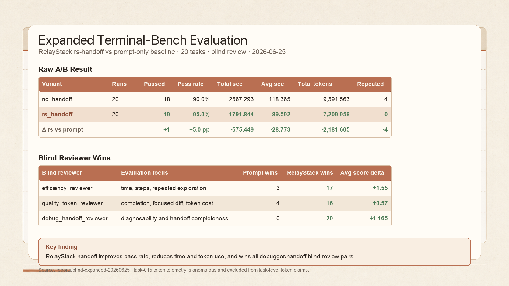

# Expanded Terminal-Bench A/B Report

Generated: 2026-06-25

## Scope

- Added 20 benchmark tasks: `task-006` through `task-025`.
- Difficulty mix: 5 easy, 10 medium, 5 hard.
- Scenario mix: dotenv parsing, Zip Slip hardening, Retry-After parsing, promise cache recovery, dependency ordering, front matter parsing, CSV import cleanup, feature flag precedence, cursor pagination, token bucket math, SQL filters, redaction, route matching, migration sorting, JUnit aggregation, business days, deep merge, semver caret ranges, NDJSON streaming, deploy reconciliation.
- A/B variants:
  - `no_handoff`: prompt-only execution.
  - `rs_handoff`: RelayStack workflow with an rs-handoff snapshot/context packet before continuation.

## Raw A/B Result

| Runner | Runs | Passed | Pass Rate | Total Seconds | Avg Seconds | Total Tokens | Avg Tokens | Avg Steps | Repeated Known Info |
| --- | ---: | ---: | ---: | ---: | ---: | ---: | ---: | ---: | ---: |
| `no_handoff` | 20 | 18 | 90.0% | 2367.293 | 118.365 | 9,391,563 | 469,578.2 | 7.0 | 4 |
| `rs_handoff` | 20 | 19 | 95.0% | 1791.844 | 89.592 | 7,209,958 | 360,497.9 | 6.6 | 0 |

`rs_handoff` won the raw run on:

- Completion: +1 passed task.
- Time: 575.449 seconds less total time.
- Token cost: 2,181,605 fewer reported tokens.
- Repeated context: 0 repeated-known-info flags vs 4.

Known telemetry caveat: `task-015` reported anomalous token values in both groups (`no_handoff=0`, `rs_handoff=3`). The blind reviewers were instructed not to count those values as true token advantage.

## Failure Pattern

- `no_handoff` failed: `task-007`, `task-016`.
- `rs_handoff` failed: `task-016`.
- `task-007` is the clearest differential: prompt-only failed the Zip Slip path-safety task, while RelayStack handoff passed.
- `task-016` failed in both variants and remains a good candidate for future benchmark hardening or expected-output review.

## Blind Reviewer Wins

| Reviewer | Focus | `no_handoff` Wins | `rs_handoff` Wins |
| --- | --- | ---: | ---: |
| `efficiency_reviewer` | elapsed time, steps, repeated exploration | 3 | 17 |
| `quality_token_reviewer` | completion, focused diff, token cost | 4 | 16 |
| `debug_handoff_reviewer` | diagnosability and handoff completeness | 0 | 20 |

Average blind score by reviewer:

- `efficiency_reviewer`: `no_handoff=6.40`, `rs_handoff=7.95`.
- `quality_token_reviewer`: `no_handoff=7.81`, `rs_handoff=8.38`.
- `debug_handoff_reviewer`: `no_handoff=7.43`, `rs_handoff=8.595`.

## Blindness Checks

- `packets.jsonl` has 40 anonymized records and does not expose `runner`, `snapshot_generated`, or `context_packet_summary`.
- `debug-packets.jsonl` keeps debugger/handoff context but still omits runner names.
- `unblind-map.json` is the only file that maps anonymous candidates back to real runners.
- `reviews.jsonl` has 120 rows: 3 reviewers x 20 pairs x 2 candidates.

## Interpretation

The expanded benchmark is harder than the original 5-task sample: prompt-only no longer reaches a clean 100% pass rate. RelayStack handoff produced better completion, lower total elapsed time, lower reported token use, and much stronger blind debugger/handoff ratings.

The main product signal is the handoff surface: reviewers consistently favored the candidate that carried an explicit context packet/root-cause/validation summary, especially for continuation and failure diagnosis.

## Primary Artifacts

- `reports/no_handoff-expanded-20260625.jsonl`
- `reports/rs_handoff-expanded-20260625.jsonl`
- `reports/blind-expanded-20260625/raw-runs.jsonl`
- `reports/blind-expanded-20260625/packets.jsonl`
- `reports/blind-expanded-20260625/debug-packets.jsonl`
- `reports/blind-expanded-20260625/reviews.jsonl`
- `reports/blind-expanded-20260625/unblind-map.json`
- `reports/blind-expanded-20260625/final.generated.md`
